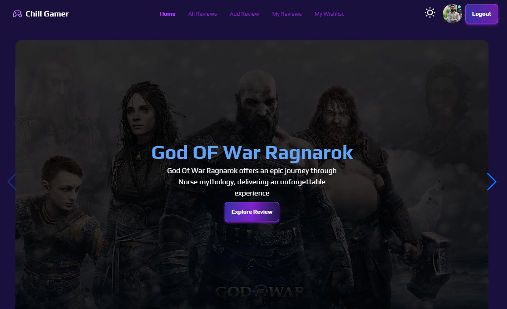

# ChillGamer

ChillGamer is a game review website where gamers can share their reviews and ratings of various games. This platform allows users to read reviews, rate games, and stay updated with the latest in the Gaming World.

## Features

- **User Reviews**: Users can write and share reviews for different games.
- **Review Updates**: Users can update their reviews.
- **Rating System**: Each game can be rated by users, providing an overall rating score.
- **Game Listings**: Browse through a wide selection of games and their details.
- **Sorting Functionality**: Users can sort games by release date or rating in both ascending and descending order.
- **Filtering Functionality**: Users can filter games by genres.
- **Wishlist**: Users can add games to their wishlist and also can be delete it from wishlist.
- **Authentication**: Users can register and log in to their account.
- **Dark/Light Theme**: Users can toggle between dark and light themes for a personalized viewing experience.
- **Responsive Design**: The website is fully responsive and works on all devices.

## Technologies

### **Frontend**
- **React** – For building component-based UIs.
- **React Router** – For navigation and routing within the app.
- **Tailwind CSS & DaisyUI** – For modern, responsive styling.
- **react-awesome-reveal** – To reveal sections with smooth animations.
- **react-countup** – To animate numbers in a count-up format.
- **react-simple-typewriter** – To create a typewriter effect for text.
- **react-toastify** – For displaying alerts and notifications.
- **animate.css** – For applying smooth animations to elements.
- **react-tooltip** – To display additional information in tooltips.
- **SweetAlert2** – For creating elegant alert dialogs.
- **Swiper** – For interactive UI elements like carousels and sliders.

### **Backend**
- **Node.js & Express.js** – Server-side logic.
- **MongoDB** – Database for storing user and order data.
- **Firebase Authentication** – Secure login and signup.

## npm Packages Used

### **Core Dependencies**
- `@emotion/react`: Styling for modern React components.
- `animate.css`: Pre-built animation styles for UI effects.
- `firebase`: Firebase for authentication and data integration.
- `localforage`: Offline storage for web apps.
- `match-sorter`: Sorting library for matching data.
- `react`: Core React library for building components.
- `react-animated-cursor`: Custom animated cursors for interactive websites.
- `react-awesome-reveal`: React-based animations for components.
- `react-countup`: Animated counting component.
- `react-dom`: DOM rendering for React components.
- `react-icons`: Customizable icons for React applications.
- `react-intersection-observer`: Intersection observer for lazy loading.
- `react-loader-spinner`: Stylish and customizable loading spinners.
- `react-router-dom`: Routing and navigation for React apps.
- `react-simple-typewriter`: Typewriter effect for text animation.
- `react-toastify`: Notification library for React apps.
- `react-tooltip`: Customizable tooltips for elements.
- `sort-by`: Sorting data based on specified criteria.
- `sweetalert2`: Beautiful alerts and pop-ups for the UI.
- `swiper`: Modern touch sliders for images and content.

### **Development Tools**
- `@eslint/js`: JavaScript linting for code quality.
- `@types/react`: TypeScript definitions for React.
- `@types/react-dom`: TypeScript definitions for React DOM.
- `@vitejs/plugin-react`: Vite plugin for React support.
- `autoprefixer`: PostCSS plugin for vendor prefixing.
- `daisyui`: Tailwind CSS component library for UI building.
- `eslint`: Code linting tool for maintaining code quality.
- `eslint-plugin-react`: ESLint plugin for React specific linting.
- `eslint-plugin-react-hooks`: Linting rules for React Hooks.
- `eslint-plugin-react-refresh`: Fast refresh support for React.
- `globals`: Global variables for various environments.
- `postcss`: Tool for transforming CSS with plugins.
- `tailwindcss`: Utility-first CSS framework for building custom designs.
- `vite`: Fast development server and build tool for modern web apps.

## Live Site
Visit the live site at [ChillGamer](https://chill-gamer-d4be4.web.app/)

## ⚙️ Installation

To run Bistro Boss locally, follow these steps:  
##

### 1️⃣ Clone the Repository  
- git clone https://github.com/Atef-Abrar-Bhuyian/Chill-Gamer-Client.git
- cd bistro-boss

### 2️⃣ Install Dependencies
- npm install  

### 3️⃣ Set Up .env
- VITE_apiKey=your_api_key
- VITE_authDomain=your_auth_domain
- VITE_projectId=your_project_id
- VITE_storageBucket=your_storage_bucket
- VITE_messagingSenderId=your_messaging_sender_id
- VITE_appId=your_app_id

### 4️⃣ Start the Development Server
- npm run dev

